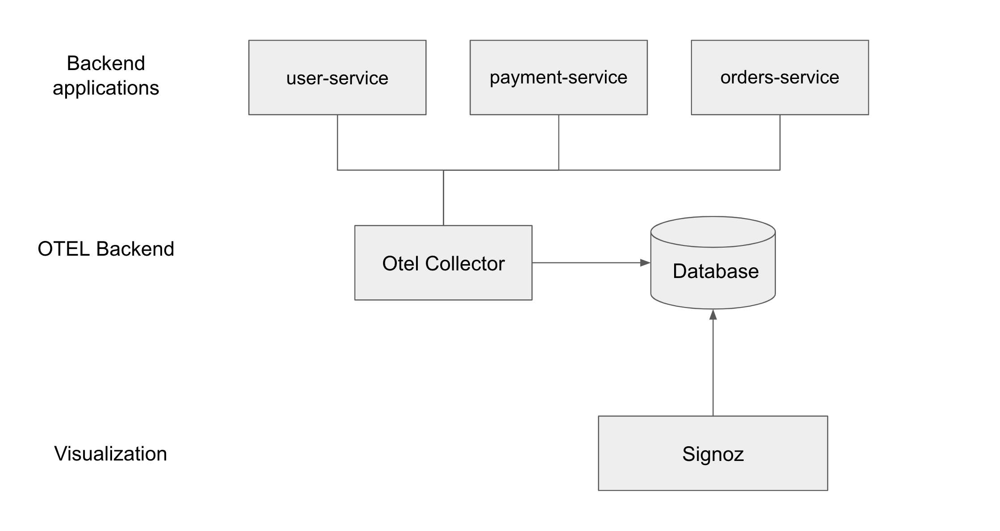

# opentelemetry-nodejs-distributed-tracing

This project demonstrates how to implement distributed tracing in node js with the help for below microservices
### Tracing flow


### Running the code

Install all the dependencies by runing `npm install`

Spin up the services

- `npm run users`
- `npm run payment`
- `npm run orders`

# How to view traces:

Use below UI application to generate some traces into signoz
```
npm install -g serve
serve ui
```

Open http://localhost:3000/


View traces, logs and metrics:

- View the metrics in signoz, go to http://localhost:3301/application 
